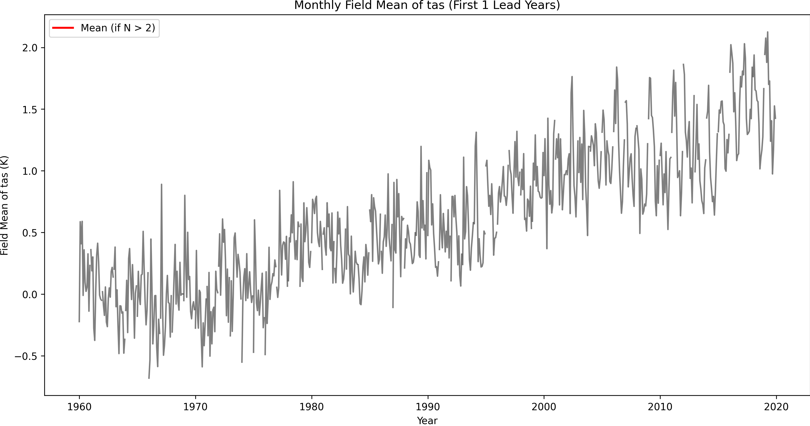
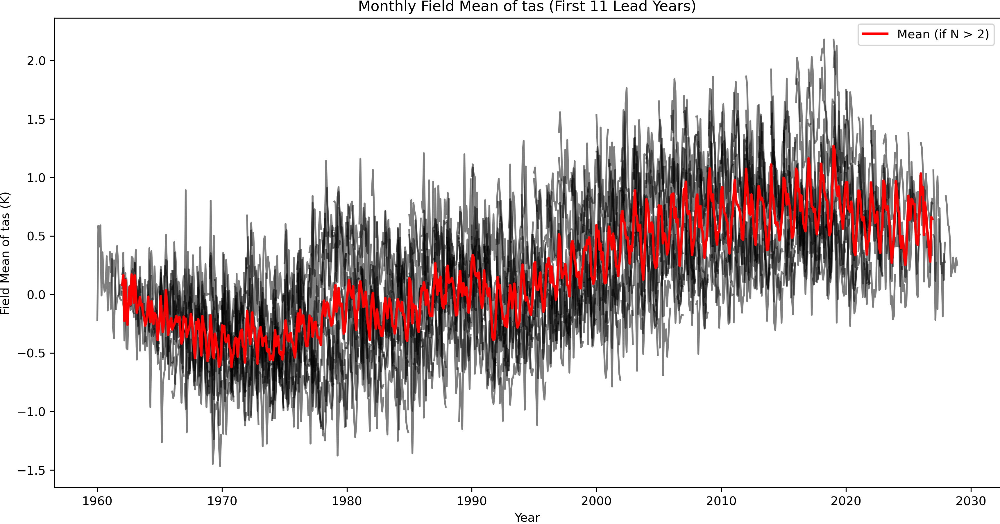

# Decadal Prediction Processor

[](LICENSE)

This project processes decadal prediction NetCDF files to extract monthly values with dimensions: `time`, `lead_year`, `initialization_year`, `lat`, and `lon`.

## **Features**
- Merges multiple NetCDF files.
- Adds `initialization_year` and `lead_year` dimensions.
- Saves the output to a new NetCDF file.

## **Requirements**
- Python 3.8+
- Libraries: `xarray`, `netCDF4`, `numpy`, `dask`

## **Installation**
1. Clone the repository:
   ```bash
   git clone https://github.com/yourusername/decadal_prediction_processor.git
   cd decadal_prediction_processor
   ```

2. Install dependencies:
    ```bash
     mamba env create -f environment.yml
     conda activate decadal_prediction_processor
     
    ```

## Usage 

1. Place your NetCDF files in a directory.

2. Update the input_dir and output_file paths in run.py.

3. Run the script:

    ```bash 
        python run.py
    ```
## Output

The output file will contain:

1. Dimensions: time, lead_year, initialization_year, lat, lon.
2. Variables: tas (near-surface air temperature).

## Tests
Run tests using:
```bash 
    pip install tox
    tox 
```
## run plot testing 
```python
from src.plot_time_series import plot_global_mean_tas

pyplot_global_mean_tas(
        "/work/kd1418/codes/work/k202196/MYWORK/tas_Amon_MPI-ESM-LR_dkfen41979-2021_r26i2p1.nc",
        num_lead_years=2,
        output_plot=f"first_2_lead_years_with_mean.png",
    )

```
- First 1 lead years: 



- Full lead years: 


## License 

MIT License 
## TODOS: 
- finish the tests
